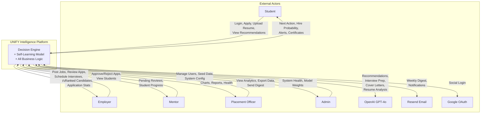
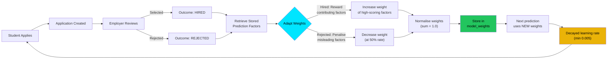
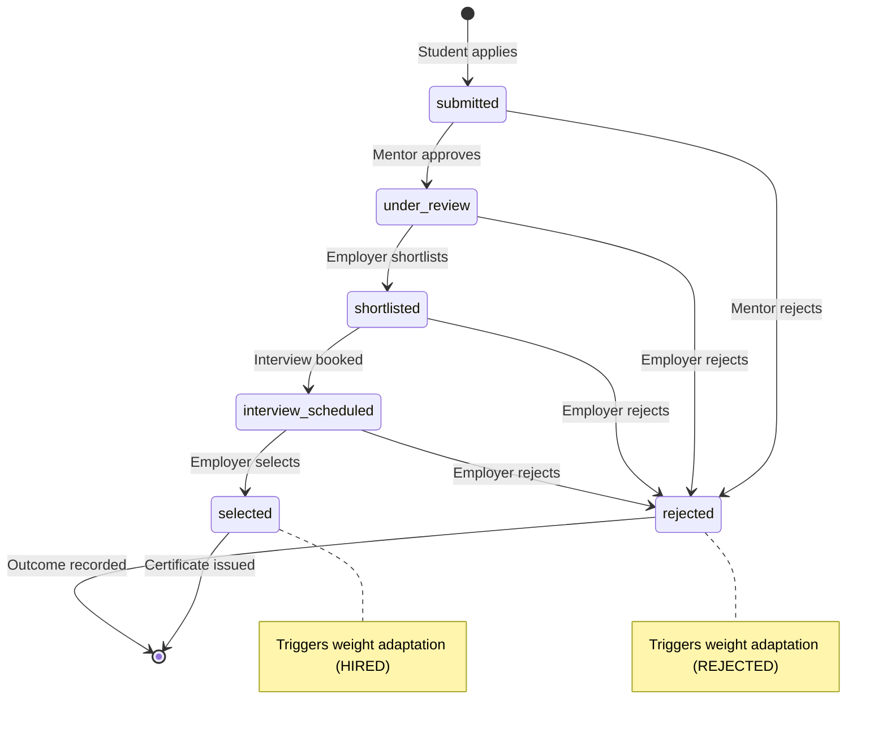
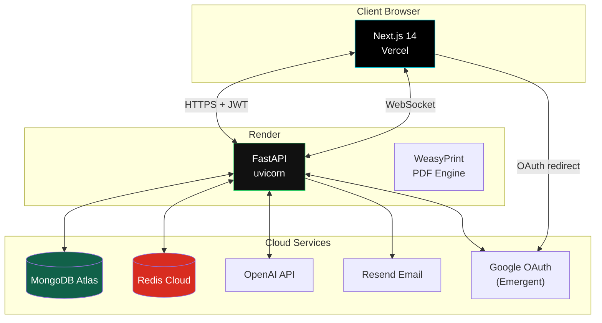

# UNIFY — Context Flow & Data Flow Diagrams

## Level 0 — Context Flow Diagram (System Boundary)

---

## Level 1 — Data Flow Diagram (Process Decomposition)

```mermaid
graph TB
    subgraph Inputs
        U_IN["User Input<br/>(forms, clicks, uploads)"]
        OAUTH["Google OAuth<br/>Session"]
    end

    subgraph P1["P1: Auth System"]
        AUTH["Authentication<br/>& Authorization"]
        JWT["JWT Token<br/>Generation"]
        BRUTE["Brute Force<br/>Protection"]
    end

    subgraph P2["P2: Profile Engine"]
        PROF["Profile CRUD"]
        STRENGTH["Strength<br/>Calculator"]
        RESUME["Resume<br/>Upload & Parse"]
    end

    subgraph P3["P3: Job & Application Engine"]
        JOBS["Job CRUD"]
        APPLY["Application<br/>Pipeline"]
        MENTOR_R["Mentor<br/>Review Gate"]
        INTERVIEW["Interview<br/>Scheduler"]
        FEEDBACK["Employer<br/>Feedback"]
        CERT["Certificate<br/>Generator"]
    end

    subgraph P4["P4: Intelligence Layer"]
        MATCH["AI Match<br/>Engine"]
        NEXT["Next-Action<br/>Decision Engine"]
        PROB["Hiring<br/>Probability"]
        CONTROL["Control<br/>System"]
        ALERT["Predictive<br/>Alerts"]
        PREP["Interview<br/>Prep AI"]
        COVER["Cover Letter<br/>Generator"]
        RES_AI["Resume AI<br/>Analyzer"]
    end

    subgraph P5["P5: Self-Learning Loop"]
        WEIGHTS["Adaptive<br/>Model Weights"]
        OUTCOMES["Outcome<br/>Recorder"]
        ADAPT["Weight<br/>Adaptation"]
    end

    subgraph P6["P6: Engagement & Analytics"]
        MOMENTUM["Momentum /<br/>XP System"]
        LEADER["Leaderboard"]
        BEHAV["Behavior<br/>Tracker"]
        ANALYTICS["Analytics<br/>& Charts"]
        HEALTH["System<br/>Health Monitor"]
        HEATMAP["Activity<br/>Heatmap"]
    end

    subgraph P7["P7: Communication"]
        NOTIF["Notification<br/>Engine"]
        WS["WebSocket<br/>Push"]
        DIGEST["Weekly<br/>Digest Email"]
    end

    subgraph Stores["Data Stores"]
        DB[(MongoDB Atlas)]
    end

    subgraph External
        GPT["OpenAI<br/>GPT-4o"]
        EMAIL["Resend<br/>API"]
    end

    U_IN --> AUTH --> JWT
    OAUTH --> AUTH
    AUTH --> BRUTE
    AUTH --> DB

    U_IN --> PROF --> STRENGTH
    U_IN --> RESUME
    PROF --> DB
    RESUME --> DB

    U_IN --> JOBS --> DB
    U_IN --> APPLY --> MENTOR_R --> APPLY
    APPLY --> DB
    APPLY --> INTERVIEW --> DB
    FEEDBACK --> CERT --> DB
    FEEDBACK --> OUTCOMES

    MATCH <--> GPT
    MATCH --> DB
    NEXT --> DB
    PROB --> WEIGHTS
    PROB --> DB
    CONTROL --> DB
    ALERT --> PROB
    PREP <--> GPT
    COVER <--> GPT
    RES_AI <--> GPT

    OUTCOMES --> ADAPT --> WEIGHTS
    WEIGHTS --> DB

    BEHAV --> DB
    MOMENTUM --> DB
    LEADER --> DB
    ANALYTICS --> DB
    HEALTH --> DB
    HEATMAP --> DB

    NOTIF --> DB
    NOTIF --> WS
    DIGEST --> EMAIL
```

---

## Level 2 — Self-Learning Feedback Loop

---

## Application State Machine

---

## Deployment Architecture

