# UNIFY — Entity Relationship Diagram

## Collections & Relationships

```mermaid
erDiagram
    USERS {
        ObjectId _id PK
        string email UK
        string password_hash
        string name
        string role "student|mentor|employer|placement|admin"
        bool is_active
        string created_at
        string updated_at
    }

    STUDENT_PROFILES {
        ObjectId _id PK
        string user_id FK "→ USERS._id"
        string first_name
        string last_name
        string department
        int semester
        float cgpa
        string phone
        string linkedin_url
        string github_url
        string resume_text
        string bio
        array skills
        string resume_url
        string created_at
        string updated_at
    }

    MENTOR_PROFILES {
        ObjectId _id PK
        string user_id FK "→ USERS._id"
        string first_name
        string last_name
        string department
        string designation
        array specialization
        string office_location
        string created_at
    }

    EMPLOYER_PROFILES {
        ObjectId _id PK
        string user_id FK "→ USERS._id"
        string company_name
        string industry
        string company_website
        string contact_person
        string contact_email
        string verification_status "pending|verified"
        string created_at
    }

    JOB_POSTINGS {
        ObjectId _id PK
        string employer_id FK "→ EMPLOYER_PROFILES._id"
        string employer_user_id FK "→ USERS._id"
        string company_name
        string title
        string description
        string job_type "internship|training|placement|project"
        string location
        bool is_remote
        int stipend_min
        int stipend_max
        int duration_months
        array required_skills
        string application_deadline
        string status "active|closed|draft"
        string created_at
    }

    APPLICATIONS {
        ObjectId _id PK
        string student_id FK "→ USERS._id"
        string job_id FK "→ JOB_POSTINGS._id"
        string mentor_id FK "→ USERS._id"
        string student_name
        string job_title
        string company_name
        string cover_letter
        string status "submitted|under_review|shortlisted|interview_scheduled|selected|rejected"
        string mentor_approval_status "pending|approved|rejected"
        string mentor_comments
        string employer_feedback
        int employer_rating
        int matching_score
        string applied_at
        string updated_at
    }

    INTERVIEWS {
        ObjectId _id PK
        string application_id FK "→ APPLICATIONS._id"
        string student_id FK "→ USERS._id"
        string job_title
        string interview_type "video|phone|in_person"
        string scheduled_date
        int duration_minutes
        string meeting_link
        string status "scheduled|completed|cancelled"
        string created_by FK "→ USERS._id"
        string created_at
    }

    CERTIFICATES {
        ObjectId _id PK
        string student_id FK "→ USERS._id"
        string application_id FK "→ APPLICATIONS._id"
        string certificate_type
        string title
        string description
        string issuer_name
        string issue_date
        string blockchain_hash UK "SHA256"
        string status "issued|revoked"
        string created_at
    }

    NOTIFICATIONS {
        ObjectId _id PK
        string user_id FK "→ USERS._id"
        string title
        string message
        string type "info|success|warning|error"
        bool read
        string action_url
        string created_at
    }

    MODEL_WEIGHTS {
        string _id PK "global"
        float skills
        float experience
        float competition
        float profile
        float timing
        int version
        int outcomes_processed
        string updated_at
    }

    HIRING_OUTCOMES {
        ObjectId _id PK
        string application_id FK "→ APPLICATIONS._id"
        string user_id FK "→ USERS._id"
        string job_id FK "→ JOB_POSTINGS._id"
        string outcome "hired|rejected"
        string recorded_at
        string recorded_by FK "→ USERS._id"
    }

    PROBABILITY_PREDICTIONS {
        ObjectId _id PK
        string user_id FK "→ USERS._id"
        string job_id FK "→ JOB_POSTINGS._id"
        float probability
        object factors
        string predicted_at
    }

    BEHAVIOR_EVENTS {
        ObjectId _id PK
        string user_id FK "→ USERS._id"
        string event_type "page_view|apply|profile_update|resume_upload"
        string target
        object metadata
        string created_at
    }

    USER_MOMENTUM {
        ObjectId _id PK
        string user_id FK "→ USERS._id"
        int current_streak
        int longest_streak
        int total_actions
        string last_active
        string created_at
    }

    RECOMMENDATIONS_CACHE {
        ObjectId _id PK
        string user_id FK "→ USERS._id"
        array recommendations
        string generated_at
    }

    RECOMMENDATIONS_SHOWN {
        ObjectId _id PK
        string user_id FK "→ USERS._id"
        int count
    }

    RECOMMENDATIONS_FOLLOWED {
        ObjectId _id PK
        string user_id FK "→ USERS._id"
        string job_id FK "→ JOB_POSTINGS._id"
        string created_at
    }

    UPLOADS {
        ObjectId _id PK
        string user_id FK "→ USERS._id"
        string file_name
        string file_data "base64"
        string type "resume"
        string uploaded_at
    }

    AUDIT_LOGS {
        ObjectId _id PK
        string user_id FK "→ USERS._id"
        string action
        object details
        string ip_address
        string created_at
    }

    LOGIN_ATTEMPTS {
        ObjectId _id PK
        string identifier "ip:email"
        int attempts
        string locked_until
    }

    PASSWORD_RESET_TOKENS {
        ObjectId _id PK
        string user_id FK "→ USERS._id"
        string token
        datetime expires_at "TTL index"
        bool used
        string created_at
    }

    USERS ||--o| STUDENT_PROFILES : "has"
    USERS ||--o| MENTOR_PROFILES : "has"
    USERS ||--o| EMPLOYER_PROFILES : "has"
    USERS ||--o{ NOTIFICATIONS : "receives"
    USERS ||--o{ AUDIT_LOGS : "generates"
    USERS ||--o| USER_MOMENTUM : "tracks"
    USERS ||--o{ BEHAVIOR_EVENTS : "emits"
    USERS ||--o| UPLOADS : "owns"
    USERS ||--o| RECOMMENDATIONS_CACHE : "has"

    EMPLOYER_PROFILES ||--o{ JOB_POSTINGS : "publishes"
    JOB_POSTINGS ||--o{ APPLICATIONS : "receives"

    USERS ||--o{ APPLICATIONS : "submits (student)"
    USERS ||--o{ APPLICATIONS : "reviews (mentor)"
    APPLICATIONS ||--o{ INTERVIEWS : "schedules"
    APPLICATIONS ||--o| CERTIFICATES : "earns"
    APPLICATIONS ||--o| HIRING_OUTCOMES : "resolves"

    USERS ||--o{ PROBABILITY_PREDICTIONS : "predicted"
    JOB_POSTINGS ||--o{ PROBABILITY_PREDICTIONS : "scored"

    MODEL_WEIGHTS ||--|| HIRING_OUTCOMES : "learns from"
    RECOMMENDATIONS_CACHE ||--o{ RECOMMENDATIONS_FOLLOWED : "tracks"
```

## Index Strategy

| Collection | Index | Type | Purpose |
|------------|-------|------|---------|
| `users` | `email` | Unique | Login lookup |
| `student_profiles` | `user_id` | Unique | Profile fetch |
| `mentor_profiles` | `user_id` | Unique | Profile fetch |
| `employer_profiles` | `user_id` | Unique | Profile fetch |
| `job_postings` | `status` | Standard | Active job queries |
| `job_postings` | `employer_id` | Standard | Employer's jobs |
| `applications` | `(student_id, job_id)` | Unique Compound | Prevent duplicates |
| `applications` | `status` | Standard | Pipeline queries |
| `certificates` | `blockchain_hash` | Standard | Verification |
| `certificates` | `student_id` | Standard | Student certs |
| `notifications` | `user_id` | Standard | User notifications |
| `audit_logs` | `user_id` | Standard | Activity trace |
| `login_attempts` | `identifier` | Standard | Brute force |
| `password_reset_tokens` | `expires_at` | TTL | Auto-purge |
