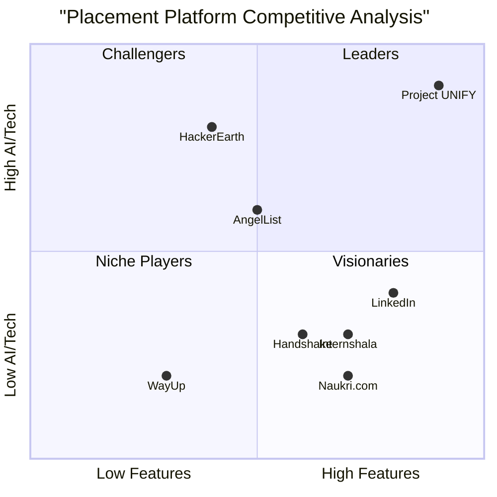
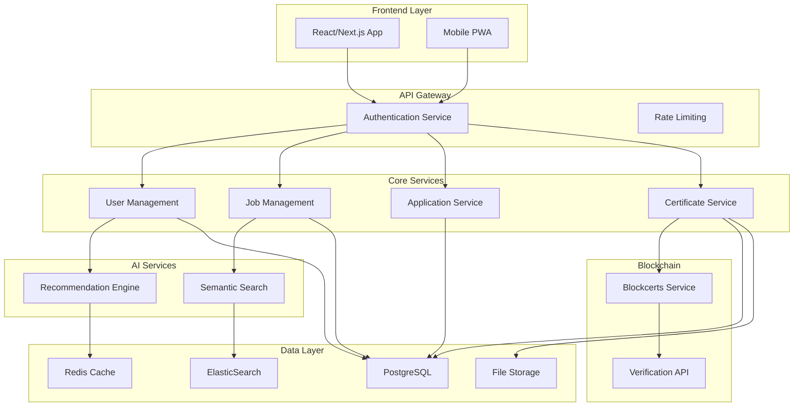

# Product Requirements Document (PRD)
# Project UNIFY - Internship & Placement Management Platform

**Version:** 1.0  
**Date:** September 22, 2025  
**Language:** English  
**Programming Language:** React/Next.js, TypeScript, TailwindCSS, shadcn/ui  
**Project Name:** project_unify  

## Original Requirements Restatement

Build a full-stack, production-ready web application called **Project UNIFY** that serves as a comprehensive internship and placement management platform with AI-powered matching and blockchain-verified certificates. The platform follows a three-pillar philosophy: Portal as Body (core dashboards & workflows), AI as Brain (resume ↔ role matching), and Blockchain as Spine (tamper-proof achievements).

---

## 1. Executive Summary

### 1.1 Project Philosophy

Project UNIFY revolutionizes university placement management through a three-pillar architecture:

- **Portal = Body**: Core dashboards and workflows that serve as the central nervous system for all placement activities
- **AI = Brain**: Intelligent resume-to-role matching engine that provides personalized recommendations
- **Blockchain = Spine**: Immutable certificate verification system ensuring credential authenticity

### 1.2 Vision Statement

To create a unified, intelligent, and trustworthy platform that bridges the gap between academic achievement and industry requirements, ensuring transparent and efficient placement processes for all stakeholders.

### 1.3 Business Objectives

- Streamline internship and placement processes for educational institutions
- Increase placement success rates through AI-powered matching
- Establish trust in academic credentials through blockchain verification
- Reduce administrative overhead for placement cells by 60%
- Improve student-employer matching accuracy by 80%

---

## 2. Product Definition

### 2.1 Product Goals

1. **Operational Excellence**: Create a seamless, automated workflow that reduces manual intervention in placement processes while maintaining quality control through mentor approvals and role-based access.

2. **Intelligent Matching**: Implement AI-driven recommendation systems that analyze student profiles, skills, and preferences to match them with relevant opportunities, increasing placement success rates.

3. **Trust & Verification**: Establish a blockchain-based certificate verification system that provides employers with tamper-proof credentials and students with portable, verifiable achievements.

### 2.2 User Stories

**As a Student**, I want to build a comprehensive profile with skills and achievements so that I can receive personalized internship recommendations and track my application status in real-time.

**As a Faculty Mentor**, I want to receive automated approval requests and monitor student progress so that I can provide timely guidance and ensure quality placements.

**As a Placement Cell Officer**, I want to manage job postings and view real-time analytics so that I can optimize placement strategies and generate comprehensive reports for administration.

**As an Employer**, I want to post verified openings and access pre-screened candidates so that I can efficiently identify suitable interns while maintaining candidate privacy.

**As a System Administrator**, I want to manage user roles and access permissions so that I can ensure data security and compliance with privacy regulations.

### 2.3 Competitive Analysis

| Platform | Strengths | Weaknesses | Market Position |
|----------|-----------|------------|-----------------|
| **Internshala** | Large job database, user-friendly interface | Limited AI matching, no blockchain verification | Market leader in India |
| **LinkedIn** | Professional networking, established user base | Generic platform, not education-focused | Global professional network |
| **Handshake** | University-focused, employer verification | Limited international presence, basic matching | US university market leader |
| **AngelList** | Startup-focused, quality opportunities | Limited to tech/startup sector | Niche startup platform |
| **Naukri.com** | Established brand, large employer base | Outdated interface, poor matching algorithm | Traditional job portal |
| **HackerEarth** | Technical assessment integration | Limited to tech roles, complex interface | Developer-focused platform |
| **WayUp** | Entry-level focus, mobile-first design | Limited features, basic functionality | Entry-level job market |

### 2.4 Competitive Quadrant Chart

---

## 3. Technical Requirements

### 3.1 Requirements Analysis

Project UNIFY requires a modern, scalable architecture capable of handling multiple user types, real-time data processing, AI-powered recommendations, and blockchain integration. The system must support role-based access control, secure data handling, and seamless third-party integrations.

### 3.2 Technology Stack

**Frontend:**
- React with Next.js framework for server-side rendering and optimal performance
- TypeScript for type safety and better developer experience
- TailwindCSS for utility-first styling and rapid UI development
- shadcn/ui for consistent, accessible component library
- Lucide React for scalable vector icons
- Framer Motion for smooth animations and micro-interactions

**Backend:**
- Node.js with Express.js or NestJS for scalable API development
- Alternative: Python with FastAPI for high-performance async operations
- JWT with refresh tokens for secure authentication
- Role-based access control (RBAC) implementation

**Database & Storage:**
- PostgreSQL as primary database for relational data
- Redis for caching, session management, and job queues
- ElasticSearch for semantic search and AI matching
- MinIO or AWS S3 for file storage (resumes, certificates)

**AI & Analytics:**
- BERT-based embedding models for semantic matching
- Custom recommendation engine with cosine similarity
- Real-time analytics processing

**Blockchain:**
- Blockcerts integration for certificate anchoring
- Open Badges standard for credential metadata
- Public verification endpoints

**DevOps & Deployment:**
- Docker containerization for all services
- Kubernetes manifests for orchestration
- CI/CD pipeline with automated testing

### 3.3 Requirements Pool

#### P0 Requirements (Must-Have)
- User authentication and role-based access control
- Student profile management with resume upload
- Job posting creation and management
- Application workflow with mentor approval
- Basic matching algorithm based on skills and preferences
- Certificate generation and storage
- Real-time dashboards for all user types
- Mobile-responsive design
- Data encryption at rest and in transit

#### P1 Requirements (Should-Have)
- AI-powered recommendation engine with semantic matching
- Blockchain certificate verification
- Calendar integration for interview scheduling
- Advanced analytics and reporting
- LMS integration for student data sync
- Assessment platform integration
- Audit logging for all user actions
- Multi-language support (English/Hindi)

#### P2 Requirements (Nice-to-Have)
- AI chatbot for career assistance
- Employer rating and review system
- Marketplace integration with external job boards
- Advanced data visualization with custom charts
- Mobile application (PWA conversion)
- Video interview integration
- Automated email notifications and reminders

### 3.4 Architecture Overview

---

## 4. User Personas & User Journeys

### 4.1 Primary Personas

#### Student - "Siba Prasad Panda"
- **Demographics**: 20-year-old Computer Science student, tech-savvy
- **Goals**: Find relevant internships, build professional profile, gain industry experience
- **Pain Points**: Information overload, unclear application status, limited industry connections
- **Tech Comfort**: High - uses multiple apps daily, expects intuitive interfaces

#### Faculty Mentor - "Dr. Sarah Johnson"
- **Demographics**: 45-year-old Associate Professor, moderate tech user
- **Goals**: Guide students effectively, monitor progress, maintain academic standards
- **Pain Points**: Time constraints, manual approval processes, lack of visibility into student activities
- **Tech Comfort**: Medium - prefers simple, efficient interfaces

#### Placement Officer - "Raj Patel"
- **Demographics**: 35-year-old Placement Cell Coordinator, data-driven
- **Goals**: Maximize placement rates, maintain employer relationships, generate reports
- **Pain Points**: Manual data compilation, difficulty tracking multiple applications, limited analytics
- **Tech Comfort**: High - comfortable with dashboards and analytics tools

#### Employer - "Lisa Wang"
- **Demographics**: 32-year-old HR Manager at tech startup
- **Goals**: Find qualified interns, streamline hiring process, verify candidate credentials
- **Pain Points**: Unqualified applications, credential verification challenges, time-consuming screening
- **Tech Comfort**: High - uses multiple HR tools, values efficiency

### 4.2 User Journey Maps

#### Student Application Journey
1. **Discovery**: Student logs in and sees AI-recommended opportunities
2. **Profile Update**: Updates skills, uploads resume, adds recent achievements
3. **Application**: One-click apply to recommended positions
4. **Approval**: Mentor receives notification and approves application
5. **Interview**: Calendar sync schedules interview automatically
6. **Completion**: Supervisor feedback triggers certificate generation
7. **Verification**: Blockchain-anchored certificate available for future use

#### Employer Hiring Journey
1. **Posting**: Creates verified job posting with specific requirements
2. **Matching**: AI system matches and ranks suitable candidates
3. **Review**: Accesses consented candidate information only
4. **Selection**: Shortlists candidates and schedules interviews
5. **Feedback**: Provides supervisor feedback post-internship
6. **Verification**: Can verify student certificates through blockchain

---

## 5. Detailed Feature Specifications

### 5.1 Student Module

#### 5.1.1 Profile Builder
**Must Requirements:**
- Personal information form with validation
- Skills assessment with proficiency levels
- Academic record integration
- Resume upload with PDF parsing
- Portfolio link management

**Should Requirements:**
- Dynamic skill suggestions based on course history
- Achievement badge display system
- Social media profile integration
- Peer endorsement system

#### 5.1.2 Badge System
**Must Requirements:**
- Semester-wise badge sheet creation
- Badge category management (Technical, Soft Skills, Certifications)
- Progress tracking visualization
- Badge verification status

**Should Requirements:**
- Automated badge suggestions based on completed courses
- Peer verification for skill badges
- Integration with external certification platforms

#### 5.1.3 AI Recommendations
**Must Requirements:**
- Personalized opportunity feed
- Matching score display with explanation
- Filter and sort capabilities
- Save for later functionality

**Should Requirements:**
- Learning path recommendations
- Skill gap analysis
- Career trajectory suggestions
- Industry trend insights

#### 5.1.4 Application Management
**Must Requirements:**
- One-click application submission
- Real-time status tracking
- Application history with timestamps
- Mentor approval workflow integration

**Should Requirements:**
- Application analytics (view rates, response rates)
- Automated follow-up reminders
- Interview preparation resources
- Feedback collection system

### 5.2 Faculty Mentor Module

#### 5.2.1 Approval Workflows
**Must Requirements:**
- Automated approval request notifications
- Bulk approval capabilities
- Application review interface with student details
- Approval/rejection with comments

**Should Requirements:**
- Risk assessment indicators for applications
- Historical performance data for decision support
- Automated approval rules based on criteria
- Integration with academic performance data

#### 5.2.2 Progress Monitoring
**Must Requirements:**
- Student dashboard with current internships
- Progress milestone tracking
- Communication channel with students
- Performance report generation

**Should Requirements:**
- Predictive analytics for student success
- Automated check-in reminders
- Integration with employer feedback
- Intervention alert system for struggling students

### 5.3 Placement Cell Module

#### 5.3.1 Posting Management
**Must Requirements:**
- Job posting creation with rich text editor
- Skill tagging and requirement specification
- Application deadline management
- Posting status controls (draft, active, closed)

**Should Requirements:**
- Template library for common postings
- Automated posting to external platforms
- Employer verification workflow
- Posting performance analytics

#### 5.3.2 Analytics Dashboard
**Must Requirements:**
- Real-time application statistics
- Placement rate visualization
- Department-wise performance metrics
- Export functionality for reports

**Should Requirements:**
- Predictive placement analytics
- Trend analysis with historical data
- Custom dashboard creation
- Automated report scheduling

#### 5.3.3 Interview Management
**Must Requirements:**
- Interview scheduling interface
- Calendar integration with Google/Outlook
- Automated notifications to all parties
- Interview feedback collection

**Should Requirements:**
- Video interview platform integration
- Interview room booking system
- Automated reminder system
- Interview performance analytics

### 5.4 Employer Module

#### 5.4.1 Verified Postings
**Must Requirements:**
- Company verification process
- Posting creation with detailed requirements
- Application management interface
- Candidate shortlisting tools

**Should Requirements:**
- Industry-specific posting templates
- Automated candidate ranking
- Integration with ATS systems
- Posting performance metrics

#### 5.4.2 Candidate Access
**Must Requirements:**
- Privacy-compliant candidate profiles
- Consent-based information sharing
- Secure communication channels
- Application tracking system

**Should Requirements:**
- Advanced search and filtering
- Candidate comparison tools
- Interview scheduling integration
- Reference check workflow

#### 5.4.3 Feedback System
**Must Requirements:**
- Structured feedback forms
- Performance rating system
- Certificate trigger mechanism
- Feedback history tracking

**Should Requirements:**
- Automated feedback reminders
- Feedback analytics and insights
- Integration with certificate generation
- Supervisor training resources

### 5.5 Certificate & Blockchain Module

#### 5.5.1 Certificate Generation
**Must Requirements:**
- Automated certificate creation based on feedback
- Open Badges JSON standard compliance
- PDF certificate generation
- Digital signature integration

**Should Requirements:**
- Custom certificate templates
- Multi-language certificate support
- Batch certificate processing
- Certificate analytics

#### 5.5.2 Blockchain Integration
**Must Requirements:**
- Blockcerts integration for hash anchoring
- Public verification endpoint
- Immutable record creation
- Certificate authenticity validation

**Should Requirements:**
- Multiple blockchain network support
- Smart contract integration
- Decentralized identity management
- Cross-platform verification

---

## 6. Security & Privacy Requirements

### 6.1 Authentication & Authorization
**Must Requirements:**
- JWT-based authentication with refresh tokens
- Role-based access control (RBAC) with granular permissions
- Multi-factor authentication for admin users
- Session management with automatic timeout

**Should Requirements:**
- Single Sign-On (SSO) integration
- OAuth integration with Google/Microsoft
- Biometric authentication support
- Advanced threat detection

### 6.2 Data Protection
**Must Requirements:**
- AES-256 encryption for data at rest
- TLS 1.3 for data in transit
- PII data anonymization capabilities
- GDPR compliance framework

**Should Requirements:**
- End-to-end encryption for sensitive communications
- Data loss prevention (DLP) tools
- Advanced encryption key management
- Zero-knowledge architecture for sensitive data

### 6.3 Audit & Compliance
**Must Requirements:**
- Comprehensive audit logging for all user actions
- Data retention policy implementation
- Privacy consent management
- Regular security assessment protocols

**Should Requirements:**
- Real-time security monitoring
- Automated compliance reporting
- Blockchain-based audit trails
- Advanced anomaly detection

---

## 7. Integration Requirements

### 7.1 Calendar Integration
**Must Requirements:**
- Google Calendar API integration
- Outlook Calendar API integration
- Automated interview scheduling
- Conflict detection and resolution

**Should Requirements:**
- Multiple calendar platform support
- Smart scheduling with AI optimization
- Timezone handling for global users
- Calendar sharing capabilities

### 7.2 LMS Integration
**Must Requirements:**
- Moodle API integration for student data
- ERPNext integration for academic records
- Automated student roster synchronization
- Grade and performance data import

**Should Requirements:**
- Canvas LMS integration
- Blackboard integration
- Custom LMS connector framework
- Real-time data synchronization

### 7.3 Assessment Platform Integration
**Must Requirements:**
- Talview API integration for video assessments
- HirePro integration for technical tests
- Mettl platform connectivity
- Assessment result synchronization

**Should Requirements:**
- Custom assessment platform connectors
- AI-powered assessment analysis
- Automated assessment scheduling
- Performance benchmarking

---

## 8. AI Matching Engine Specifications

### 8.1 Core Algorithm
**Must Requirements:**
- BERT-based embedding generation for resumes and job descriptions
- Cosine similarity calculation for matching scores
- Skill-based filtering and ranking
- Department and location-based constraints

**Should Requirements:**
- Custom CareerBERT model training
- Multi-modal matching (text, skills, preferences)
- Continuous learning from user feedback
- Explainable AI for matching decisions

### 8.2 Recommendation System
**Must Requirements:**
- Top 5 personalized recommendations per student
- Real-time recommendation updates
- Feedback loop for recommendation improvement
- A/B testing framework for algorithm optimization

**Should Requirements:**
- Collaborative filtering integration
- Career path prediction
- Industry trend incorporation
- Personalized learning recommendations

### 8.3 Performance Metrics
**Must Requirements:**
- Matching accuracy measurement
- User engagement tracking
- Recommendation click-through rates
- Placement success correlation

**Should Requirements:**
- Advanced ML model performance monitoring
- Bias detection and mitigation
- Model drift detection
- Automated model retraining

---

## 9. UI/UX Guidelines

### 9.1 Design Principles
**Must Requirements:**
- Clean, minimal interface design
- Consistent component library usage (shadcn/ui)
- Accessible design following WCAG 2.1 guidelines
- Mobile-first responsive design

**Should Requirements:**
- Dark and light mode support
- Customizable dashboard layouts
- Advanced data visualization
- Micro-interactions with Framer Motion

### 9.2 User Experience
**Must Requirements:**
- Intuitive navigation with clear information hierarchy
- Progressive web app (PWA) capabilities
- Fast loading times (<3 seconds)
- Cross-browser compatibility

**Should Requirements:**
- Personalized user experience
- Advanced search and filtering
- Offline functionality for core features
- Voice interface integration

### 9.3 Responsive Design
**Must Requirements:**
- Mobile-optimized layouts for all screen sizes
- Touch-friendly interface elements
- Adaptive content presentation
- Performance optimization for mobile devices

**Should Requirements:**
- Tablet-specific optimizations
- Desktop advanced features
- Cross-device synchronization
- Platform-specific UI adaptations

---

## 10. Success Metrics & KPIs

### 10.1 User Engagement Metrics
- **Daily Active Users (DAU)**: Target 70% of registered users
- **Session Duration**: Average 15+ minutes per session
- **Feature Adoption Rate**: 80% of users using core features within 30 days
- **User Retention Rate**: 85% monthly retention rate

### 10.2 Placement Effectiveness
- **Placement Success Rate**: 90% of applications resulting in interviews
- **Time to Placement**: Reduce average placement time by 50%
- **Matching Accuracy**: 85% student satisfaction with recommendations
- **Employer Satisfaction**: 4.5/5 average rating from employers

### 10.3 System Performance
- **System Uptime**: 99.9% availability
- **Response Time**: <2 seconds for all API calls
- **Error Rate**: <0.1% system error rate
- **Security Incidents**: Zero data breaches

### 10.4 Business Impact
- **Administrative Efficiency**: 60% reduction in manual processing time
- **Cost Savings**: 40% reduction in placement cell operational costs
- **Certificate Verification**: 100% authentic certificate verification rate
- **Platform Growth**: 50% year-over-year user growth

---

## 11. Risk Assessment & Mitigation

### 11.1 Technical Risks

#### High Risk: AI Model Performance
- **Risk**: Poor matching accuracy leading to user dissatisfaction
- **Impact**: High - Core value proposition failure
- **Mitigation**: 
  - Implement comprehensive testing with historical data
  - Create fallback rule-based matching system
  - Establish continuous model monitoring and improvement

#### Medium Risk: Blockchain Integration Complexity
- **Risk**: Technical challenges in blockchain implementation
- **Impact**: Medium - Delayed certificate verification features
- **Mitigation**:
  - Start with proven Blockcerts implementation
  - Create modular architecture for easy blockchain layer replacement
  - Implement traditional certificate system as backup

#### Medium Risk: Third-party Integration Failures
- **Risk**: Calendar, LMS, or assessment platform API changes
- **Impact**: Medium - Feature disruption
- **Mitigation**:
  - Implement robust error handling and fallback mechanisms
  - Create abstraction layers for external integrations
  - Maintain relationships with integration partners

### 11.2 Security Risks

#### High Risk: Data Breach
- **Risk**: Unauthorized access to sensitive student/employer data
- **Impact**: High - Legal liability and reputation damage
- **Mitigation**:
  - Implement defense-in-depth security strategy
  - Regular security audits and penetration testing
  - Comprehensive data encryption and access controls

#### Medium Risk: Authentication Bypass
- **Risk**: Unauthorized access through authentication vulnerabilities
- **Impact**: High - System compromise
- **Mitigation**:
  - Multi-factor authentication implementation
  - Regular security code reviews
  - Automated vulnerability scanning

### 11.3 Business Risks

#### High Risk: Low User Adoption
- **Risk**: Students, mentors, or employers not adopting the platform
- **Impact**: High - Platform failure
- **Mitigation**:
  - Comprehensive user research and testing
  - Phased rollout with feedback incorporation
  - Strong change management and training programs

#### Medium Risk: Competitive Response
- **Risk**: Established players copying features or blocking integrations
- **Impact**: Medium - Market share loss
- **Mitigation**:
  - Focus on unique AI and blockchain differentiators
  - Build strong university partnerships
  - Continuous innovation and feature development

### 11.4 Operational Risks

#### Medium Risk: Scalability Challenges
- **Risk**: System performance degradation under high load
- **Impact**: Medium - User experience degradation
- **Mitigation**:
  - Cloud-native architecture with auto-scaling
  - Comprehensive load testing
  - Performance monitoring and optimization

#### Low Risk: Team Knowledge Gaps
- **Risk**: Lack of expertise in AI or blockchain technologies
- **Impact**: Low - Development delays
- **Mitigation**:
  - Team training and skill development programs
  - External consultant engagement for specialized areas
  - Knowledge sharing and documentation practices

---

## 12. Implementation Timeline

### Phase 1: Foundation (Months 1-3)
- Core authentication and user management
- Basic profile and job posting functionality
- Simple matching algorithm
- MVP dashboard for all user types

### Phase 2: Intelligence (Months 4-6)
- AI recommendation engine implementation
- Advanced analytics and reporting
- Calendar and LMS integrations
- Enhanced UI/UX with responsive design

### Phase 3: Trust (Months 7-9)
- Blockchain certificate integration
- Advanced security features
- Assessment platform integrations
- Performance optimization

### Phase 4: Scale (Months 10-12)
- Advanced AI features and personalization
- Mobile PWA optimization
- Advanced analytics and insights
- Multi-language support

---

## 13. Open Questions

1. **AI Model Training Data**: What historical placement data is available for training the recommendation engine? How will we handle cold start problems for new institutions?

2. **Blockchain Network Selection**: Which blockchain network should be used for certificate anchoring? Should we support multiple networks for redundancy?

3. **Integration Scope**: Which specific LMS and assessment platforms should be prioritized for initial integration? What are the API limitations and costs?

4. **Scalability Requirements**: What is the expected user load at launch and growth projections? Should we design for multi-tenant architecture from the start?

5. **Compliance Requirements**: Are there specific educational or regional compliance requirements (FERPA, local data protection laws) that need to be addressed?

6. **Monetization Strategy**: How will the platform be monetized? Will there be different pricing tiers for institutions vs. employers?

7. **Data Migration**: For existing institutions, what data migration capabilities are needed? How will legacy systems be integrated?

8. **Internationalization**: Beyond English and Hindi, what other languages should be supported for global expansion?

---

## Conclusion

Project UNIFY represents a comprehensive solution to modernize internship and placement management through intelligent automation, blockchain verification, and user-centric design. The platform's three-pillar architecture ensures scalability, trustworthiness, and efficiency while addressing the core needs of all stakeholders in the placement ecosystem.

The success of this project depends on careful execution of the technical architecture, strong user experience design, and effective change management to drive adoption across educational institutions and employers. With proper implementation of the outlined requirements and risk mitigation strategies, Project UNIFY has the potential to transform how educational institutions manage student placements and career development.